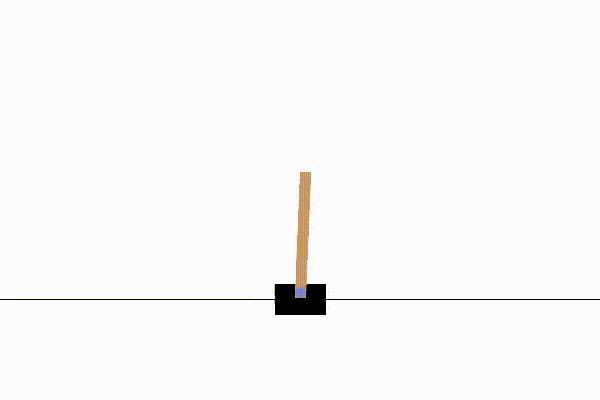
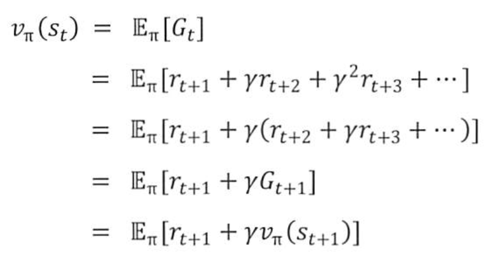
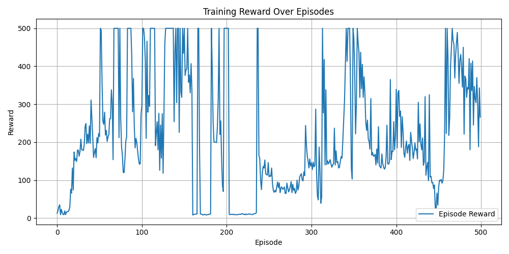
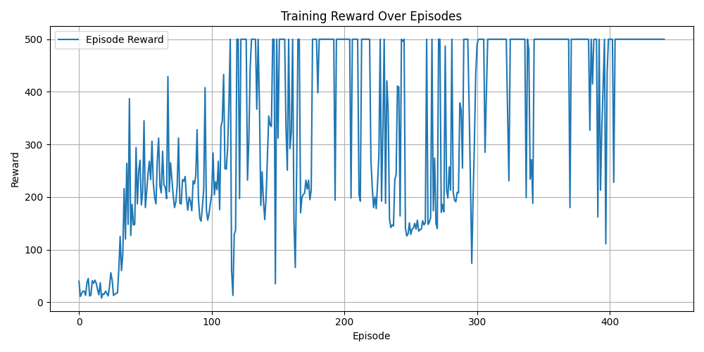

# DQN-Agent-forCartpole-v1 implementation
```markdown
This project implements a simple DQN agent using PyTorch to solve the CartPole-v1 environment from OpenAI Gym.
```
## 📁 Project Structure
```text
cartpole-dqn/
├── agents/
│   └── dqn_agent.py             # DQN agent class with training logic and replay memory
├── models/
│   └── q_network.py             # Q-Network definition
├── utils/
│   └── plot.py                  # Plotting utility for training curves
├── config/
│   └── dqn_config.yaml          # Hyperparameter configuration file
├── videos/                  
│   └── rl-video-episode-0.mp4   # A saved CartPole video from render mode
├── results/
│   ├── rewards_plot.png         # Training result curve
│   └── saved_model.pth          # Trained model checkpoint
├── main.py                     # main.py provides an easy way to switch between training, testing, and rendering modes
├── train.py                    # Training loop script
├── test.py                     # Evaluation script
├── requirements.txt            # Required packages
├── README.md                   # Project documentation
└── .gitignore                  # Ignoring __pycache__, videos, results

```

## ✅ Implemented Features
- dqn_agent.py contains the replay buffer, soft target update frequency (update_freq), and epsilon-greedy policy for action selection
- config.yaml file for storing hyperparameters
- Hyperparameters in dqn_config.yaml can be adjusted for robust convergence
- Bellman equation for target Q-value computation
- Prints the 10-episode average reward to track gradual improvement
- main.py provides an easy way to switch between training, testing, and rendering modes
- Generates a `.mp4` video to visualize the agent's performance, and converted it to `.gif` format for direct embedding in the README.

## 🚀 How to Run

```bash
# Install dependencies
pip install -r requirements.txt

# Train the agent
python main.py --mode train

# Test the trained agent
python main.py --mode test

# Render and record video
python main.py --mode render
```


## Concepts

### cartpole, what is it?
  
Try to keep the stick balanced on the cart.
The environment provides a 4-dimensional state vector: cart position, cart velocity, pole angle, and pole angular velocity. And your actions are limited to moving the cart to the left or right.

### MDP (Markov Decision process)
What happened in the past does not affect what will happen in the future; only the current state matters.

### Bellman equation
 
The value function is the expected sum of discounted rewards from a given state.

```python
# Compute max Q(s', a') from the target network
with torch.no_grad(): 
    # From bellman equation, we can get this formula
    # Q(s, a) = r + gamma * max_a' Q(s', a')
    next_q_values = self.target_network(next_states).max(1)[0].unsqueeze(1) 
    target_q_values = rewards + self.gamma * next_q_values * (1 - dones)
```
The Bellman equation describes how the value of a state-action pair is updated based on the immediate reward and the estimated value of the next state.


### DQN
Instead of a Q-table, which is commonly used in small discrete state spaces (such as grid-world environments), DQN uses a deep neural network to approximate Q-values in large and continuous state spaces. 

The Bellman equation is used to formulate the loss function, which guides the updates of the Q-network.

Key features of DQN include:

- **Experience Replay**: A replay buffer is used to store past transitions, allowing for more stable and robust training.
- **Target Network**: A separate target network is updated less frequently (soft update) to improve stability during training.
- **Initial Negative Rewards**: In environments like CartPole, when the pole falls down, the episode terminates and the agent receives a reward of 0. This termination signal acts as a strong negative feedback, encouraging the agent to keep the pole balanced for longer.


## 🔧 Code Improvement (train.py)
```python
if episode % 10 == 0:
        print(f"Episode {episode}, Reward: {episode_reward}, Epsilon: {agent.epsilon:.3f}")
```  

to  
```python
if episode % 10 == 0:
    avg_reward = np.mean(reward_history[-10:])
    print(f"Episode {episode}, Reward: {episode_reward:.1f}, "
          f"10-episode avg: {avg_reward:.1f}, Epsilon: {agent.epsilon:.3f}")
```

For seeing gradual improvement clearly.

## Tuning hyperparameter at yaml

```text
gamma: 0.99
epsilon_start: 1.0
epsilon_min: 0.01
epsilon_decay: 0.995
batch_size: 64
lr: 0.001
replay_buffer_size: 10000 
update_freq: 10
num_episodes: 500
target_reward: 475
seed: 42
```



```text
gamma: 0.99
epsilon_start: 1.0
epsilon_min: 0.05
epsilon_decay: 0.998
batch_size: 64
lr: 0.001
replay_buffer_size: 10000
update_freq: 200
num_episodes: 500
target_reward: 475
seed: 42
```

After tuning hyperparameters, we can see more robust train process.


## Next Steps
For SAC, I want to display the step count and reward in the video of the episode.
